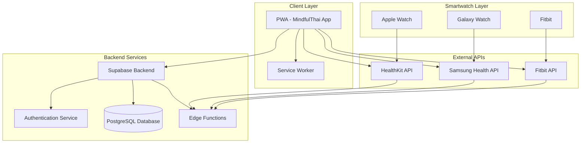
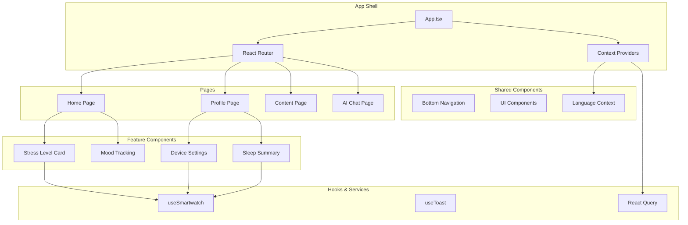
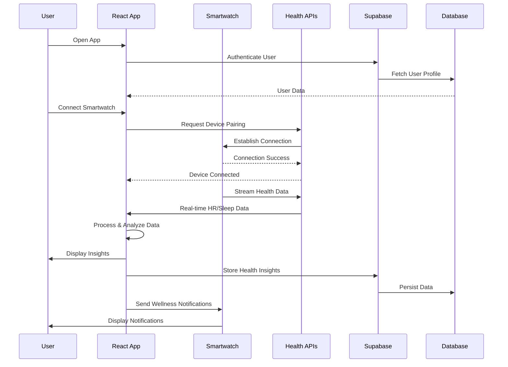
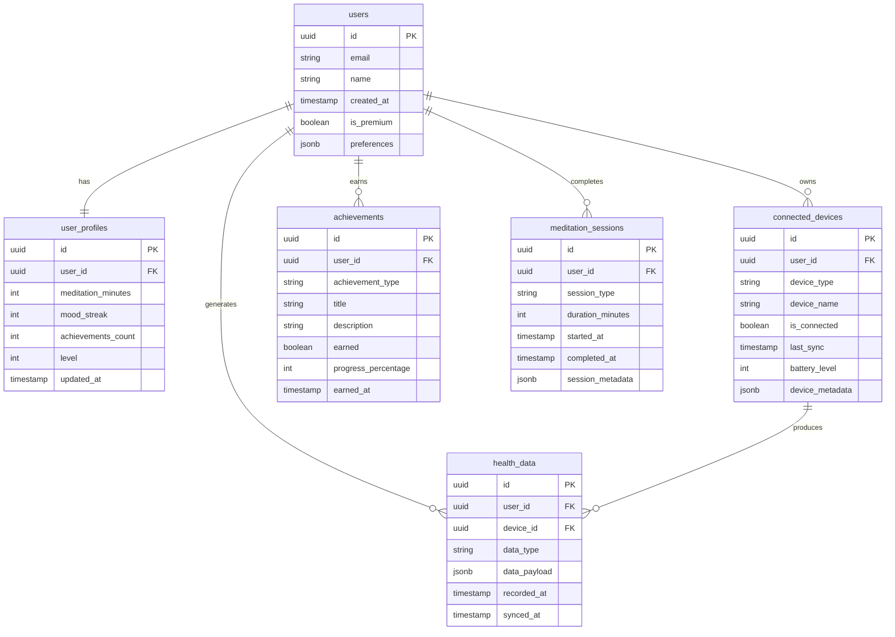

# System Architecture - MindfulThai App

## 📋 Table of Contents
- [System Overview](#system-overview)
- [Architecture Diagrams](#architecture-diagrams)
- [Component Architecture](#component-architecture)
- [Data Flow](#data-flow)
- [Integration Points](#integration-points)
- [Security Architecture](#security-architecture)

## 🏗️ System Overview

MindfulThai is a progressive web application built for mental health and wellness, featuring smartwatch integration for real-time health monitoring. The architecture follows modern React patterns with TypeScript, emphasizing component reusability and maintainable code structure.

### Technology Stack
- **Frontend:** React 18, TypeScript, Vite
- **UI Framework:** Tailwind CSS, Shadcn/UI
- **State Management:** React Context, TanStack Query
- **Routing:** React Router DOM
- **Backend:** Supabase (PostgreSQL, Auth, Edge Functions)
- **Health Integration:** HealthKit (iOS), Samsung Health, Fitbit APIs

## 📊 Architecture Diagrams

### System Overview

### Component Architecture

### Data Flow Architecture

### Database ERD

## 🧩 Component Architecture

### Core Application Components

#### **App.tsx** - Application Root
The main application component that sets up routing, context providers, and global configuration. It manages the application's initialization state and handles the onboarding flow.

**Key Responsibilities:**
- Route configuration and navigation
- Context provider setup (Language, Query Client)
- Global state initialization
- Onboarding flow management
- Error boundary implementation

**Dependencies:** React Router, TanStack Query, Language Context

#### **LanguageContext.tsx** - Internationalization
Provides comprehensive i18n support for Thai and English languages throughout the application. Manages language preferences, text translations, and cultural formatting.

**Key Features:**
- Dynamic language switching
- Persistent language preferences
- Cultural-aware date/time formatting
- Right-to-left text support for Thai
- Translation key management

#### **useSmartwatch.ts** - Health Integration Hook
Central hook for managing smartwatch connections, health data processing, and real-time monitoring. Provides a unified interface for multiple device types.

**Core Functionality:**
- Device discovery and pairing
- Real-time heart rate monitoring
- Sleep pattern analysis
- Stress level calculation
- Notification management
- Data privacy compliance

### Feature-Specific Components

#### **StressLevelCard.tsx** - Wellness Monitoring
Real-time stress level display based on heart rate variability from connected smartwatches. Provides immediate wellness recommendations and breathing exercise suggestions.

**Intelligence Features:**
- Heart rate variability analysis
- Stress pattern recognition
- Contextual wellness recommendations
- Emergency stress alert system
- Integration with meditation content

#### **DeviceSettings.tsx** - Device Management
Comprehensive smartwatch connection interface supporting Apple Watch, Galaxy Watch, and Fitbit devices. Manages permissions, sync status, and device health.

**Management Features:**
- Multi-device support
- Permission granularity
- Sync status monitoring
- Battery level tracking
- Privacy compliance interface

#### **SleepSummaryCard.tsx** - Sleep Analytics
Advanced sleep tracking with detailed analysis of sleep stages, quality metrics, and personalized recommendations for better rest.

**Analytics Capabilities:**
- Sleep stage breakdown (Deep, Light, REM)
- Sleep quality scoring
- Historical trend analysis
- Bedtime routine suggestions
- Integration with meditation content

## 🔄 Data Flow

### Health Data Pipeline
1. **Collection:** Smartwatch sensors capture biometric data
2. **Transmission:** Health APIs stream data to the application
3. **Processing:** Real-time analysis and pattern recognition
4. **Storage:** Encrypted data persistence in Supabase
5. **Insights:** AI-powered wellness recommendations
6. **Action:** Contextual notifications and content suggestions

### User Interaction Flow
1. **Authentication:** Secure login via Supabase Auth
2. **Onboarding:** Device setup and preference configuration
3. **Monitoring:** Continuous health data collection
4. **Analysis:** Real-time processing and insight generation
5. **Recommendations:** Personalized wellness suggestions
6. **Engagement:** Meditation, breathing exercises, content consumption

## 🔌 Integration Points

### External Service Integration

#### **Supabase Backend Services**
- **Authentication:** JWT-based user management
- **Database:** PostgreSQL with real-time subscriptions
- **Edge Functions:** Serverless health data processing
- **Storage:** Encrypted health data persistence

#### **Health Platform APIs**
- **Apple HealthKit:** iOS health data integration
- **Samsung Health:** Android health platform
- **Fitbit Web API:** Fitbit device data access
- **Google Fit:** Additional Android health data

#### **AI and Analytics**
- **Real-time Processing:** Stream processing for health metrics
- **Pattern Recognition:** ML-based wellness insights
- **Recommendation Engine:** Personalized content suggestions

## 🔒 Security Architecture

### Data Protection
- **Encryption:** AES-256 encryption for health data at rest
- **Transmission:** TLS 1.3 for all API communications
- **Authentication:** JWT tokens with refresh mechanism
- **Authorization:** Role-based access control (RBAC)

### Privacy Compliance
- **PDPA Compliance:** Thai Personal Data Protection Act
- **GDPR Compliance:** European privacy regulations
- **Data Minimization:** Collect only necessary health metrics
- **User Consent:** Granular permission management
- **Data Retention:** Configurable data lifecycle policies

### Security Measures
- **Input Validation:** Comprehensive sanitization
- **Rate Limiting:** API abuse prevention
- **Audit Logging:** Security event tracking
- **Incident Response:** Automated threat detection

---

**Architecture Version:** 2.1  
**Last Updated:** 2025-01-21  
**Next Review:** 2025-04-21  
**Architecture Owner:** Lead Technical Architect
